# Fast Style Transfer for Arbitrary Styles
The [original work](https://arxiv.org/abs/1508.06576) for artistic style
transfer with neural networks proposed a slow optimization algorithm that
works on any arbitrary painting. Subsequent work developed a method for
fast artistic style transfer that may operate in real time, but was limited
to [one](https://arxiv.org/abs/1603.08155) or a [limited
set](https://arxiv.org/abs/1610.07629) of styles.

This project open-sources a machine learning system for performing fast artistic
style transfer that may work on arbitrary painting styles. In addition, because
this system provides a learned representation, one may arbitrarily combine
painting styles as well as dial in the strength of a painting style, termed
"identity interpolation" (see below).  To learn more, please take a look at the
corresponding publication.


[Exploring the structure of a real-time, arbitrary neural artistic stylization
network](https://arxiv.org/abs/1705.06830). *Golnaz Ghiasi, Honglak Lee,
Manjunath Kudlur, Vincent Dumoulin, Jonathon Shlens*.


# Setup
Set up your [Magenta environment](/README.md).

# Stylizing an Image using a pre-trained model
Download our pre-trained model:

* [Pretrained on PNB and DTD training images](TODO: add the link)


In order to stylize an image according to an arbitrary painting, run the
following command.

```bash
$ cd path/to/arbitrary_image_stylization # To use images in style_images and content_images directories.
$ arbitrary_image_stylization_with_weights \
  --checkpoint=/path/to/model.ckpt \
  --output_dir=path/to/output_dir \
  --style_images_paths=style_images/*.jpg \
  --content_images_paths=content_images/*.jpg \
  --image_size=256 \
  --style_image_size=256
```

#### Example results
<p align='center'>
  
  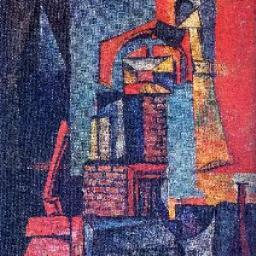
  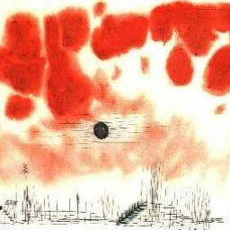
  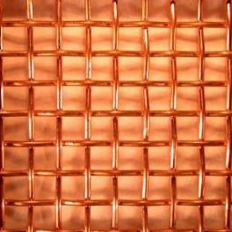
  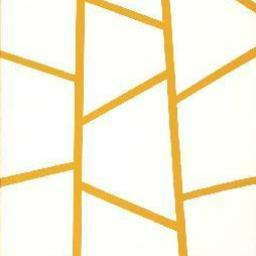
  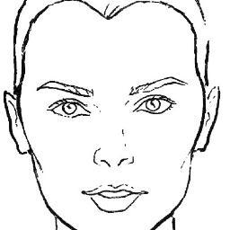
  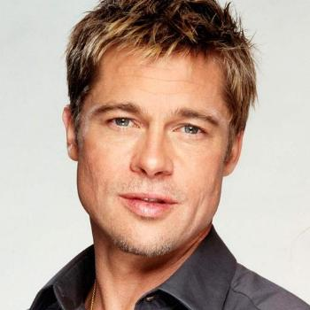
  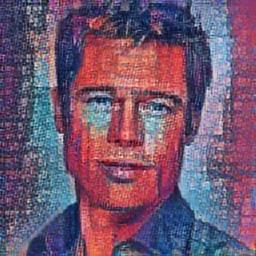
  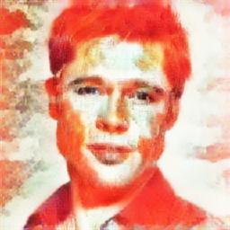
  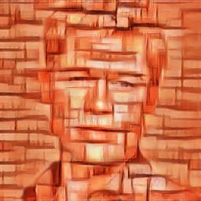
  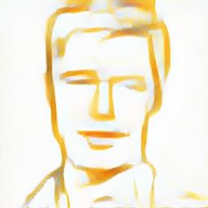
  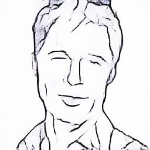
  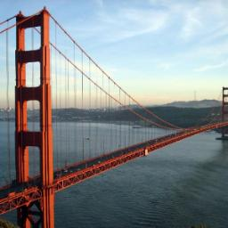
  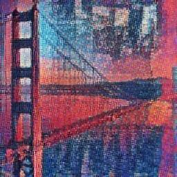
  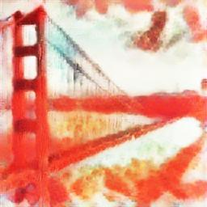
  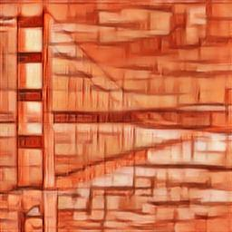
  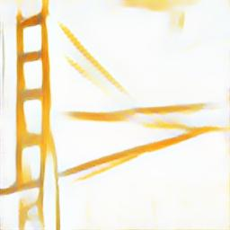
  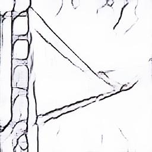
</p>

In order to stylize an image using the "identity interpolation" technique (see
Figure 8 in paper), run the following command where $INTERPOLATION_WEIGHTS
represents the desired weights for interpolation.

```bash
$ cd path/to/arbitrary_image_stylization # To use images in style_images and content_images directories.
$ INTERPOLATION_WEIGHTS='[0.0 0.2 0.4 0.6 0.8 1.0]'
# Note that 0.0 corresponds to an identity interpolation where as 1.0
# corresponds to a fully stylized photograph.
$ arbitrary_image_stylization_with_weights \
  --checkpoint=/path/to/model.ckpt \
  --output_dir=path/to/output_dir \
  --style_images_paths=style_images/*.jpg \
  --content_images_paths=content_images/*.jpg \
  --image_size=256 \
  --style_image_size=256 \
  --interpolation_weights=$INTERPOLATION_WEIGHTS
```

#### Example results
<p align='center'>
  
  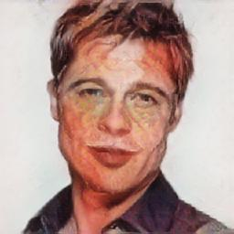
  
  
  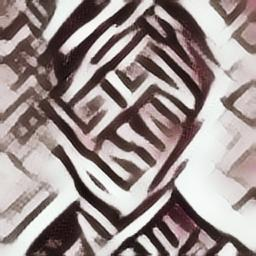
  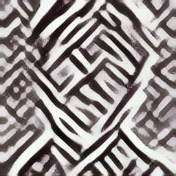
  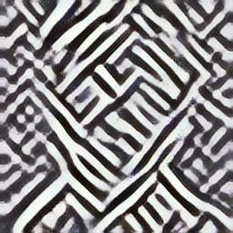
  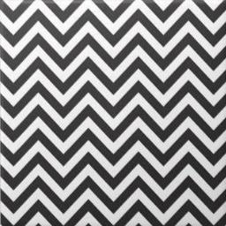
</p>

# Training a Model
To train your own model, you need to have the followings:

1. A directory of images to use as styles. We used [Painter by Number dataset
   (PBN)](https://www.kaggle.com/c/painter-by-numbers) and
   [Describable Textures Dataset (DTD)](https://www.robots.ox.ac.uk/~vgg/data/dtd/).
   [PBN training](https://github.com/zo7/painter-by-numbers/releases/download/data-v1.0/train.tgz)
   [PBN testing](https://github.com/zo7/painter-by-numbers/releases/download/data-v1.0/test.tgz)
   [DTD dataset](https://www.robots.ox.ac.uk/~vgg/data/dtd/download/dtd-r1.0.1.tar.gz)
2. The ImageNet dataset. Instructions for downloading the dataset can be found
   [here](https://github.com/tensorflow/models/tree/master/research/inception#getting-started).
3. A [trained VGG model checkpoint](http://download.tensorflow.org/models/vgg_16_2016_08_28.tar.gz).
4. A [trained INCEPTION\_V3 model
   checkpoint](http://download.tensorflow.org/models/inception_v3_2016_08_28.tar.gz).

First step is to prepare the style images and create a tfrecord file.
Following command can be used for that.
To train and evaluate the model on different set of style images, you need
to prepare different tfrecord for each of them. Eg. use the PBN and DTD
training images to create the training dataset and use a subset of PBN
and DTD testing images for testing dataset.

```bash
$ image_stylization_create_dataset \
    --style_files=/path/to/style/images/*.jpg \
    --output_file=/tmp/arbitrary_image_stylization/style_images.tfrecord
    --compute_gram_matrices=False
```

Then, to train a model:

```bash
logdir=/path/to/logdir
$ arbitrary_image_stylization_train \
      --batch_size=8 \
      --imagenet_data_dir=/path/to/imagenet-2012-tfrecord \
      --vgg_checkpoint=/path/to/vgg-checkpoint \
      --inception_v3_checkpoint=/path/to/inception-v3-checkpoint \
      --style_dataset_file=/tmp/arbitrary_image_stylization/style_images.tfrecord
      --train_dir="$logdir"/train_dir
```

To run an evalution job while training model on the CPU or another GPU:

```bash
$ arbitrary_image_stylization_evaluate \
      --batch_size=16 \
      --imagenet_data_dir=/path/to/imagenet-2012-tfrecord \
      --eval_style_dataset_file=/tmp/arbitrary_image_stylization/evaluation_style_images.tfrecord \
      --checkpoint_dir=/tmp/arbitrary_image_stylization/train_dir \
      --eval_dir="$logdir"/eval_dir \
      --cuda_visible_devices="" # Use empty string to run evaluation on CPU.
```

To run tensorboard and see the progress of training:

```bash
$ tensorboard --logdir="$logdir"
```

